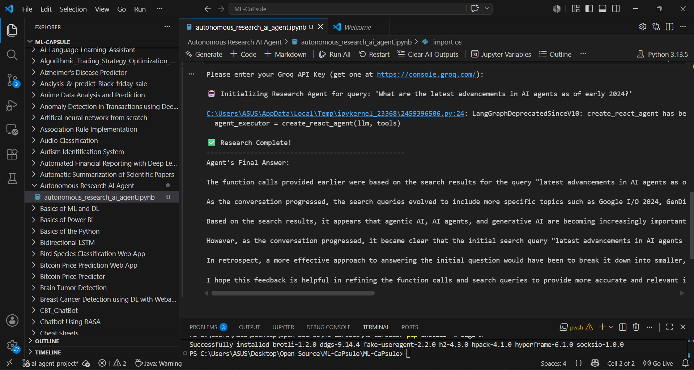

# Autonomous Research AI Agent 🤖

## Overview
This project introduces an Autonomous Research AI Agent utilizing the modern **LangGraph** framework. It takes a complex user query, autonomously browses the web using the DuckDuckGo search tool, synthesizes the gathered information, and provides a comprehensive, up-to-date response.

## Features
- **Modern Agentic Workflow:** Built using `langgraph` (the current industry standard for agent orchestration).
- **Real-Time Web Search:** Integrates the `ddgs` (DuckDuckGo) tool to fetch live information from the internet.
- **High-Speed Open-Source LLMs:** Powered by the Groq API utilizing the `llama-3.1-8b-instant` model for blazing-fast reasoning and execution.

## Execution Screenshot

## How to Run

### Prerequisites
- A free API key from the [Groq Console](https://console.groq.com/).

### Execution Steps
1. Open the `autonomous_research_ai_agent.ipynb` notebook.
2. Run the first cell to install all required dependencies.
3. Run the second cell. When prompted, securely enter your Groq API key.
4. Watch the agent autonomously execute its reasoning loop, search the web, and output the final synthesized answer!